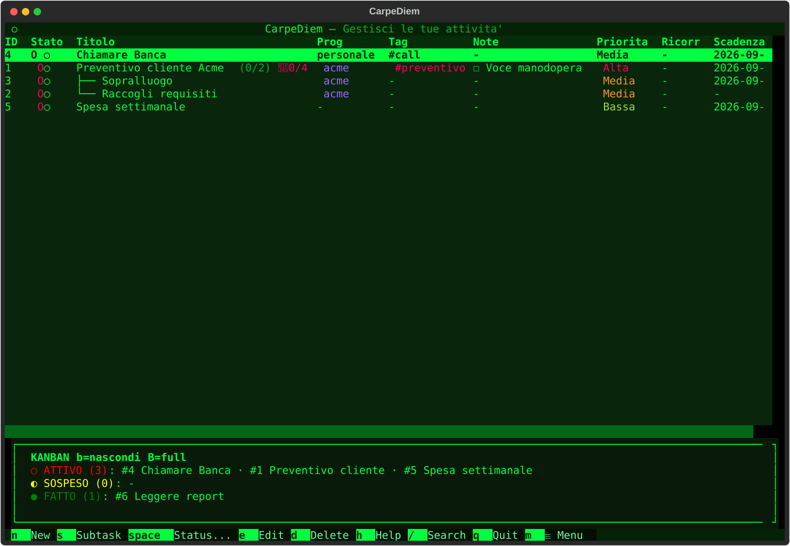
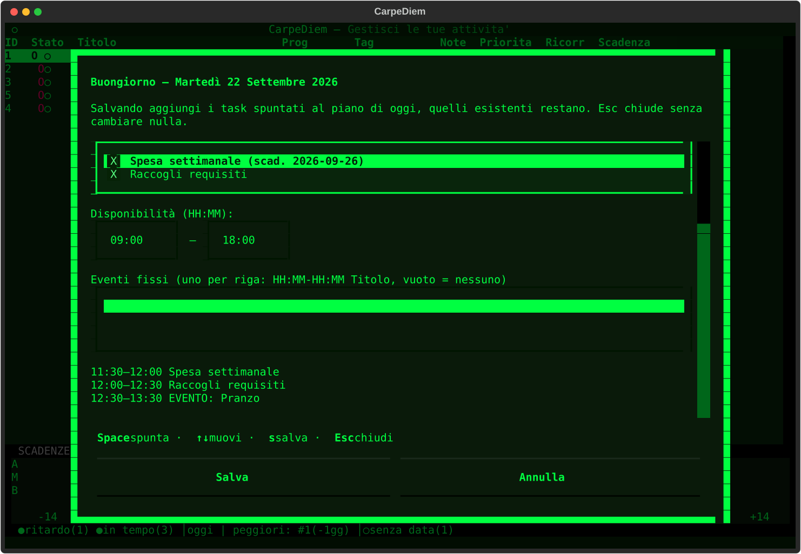
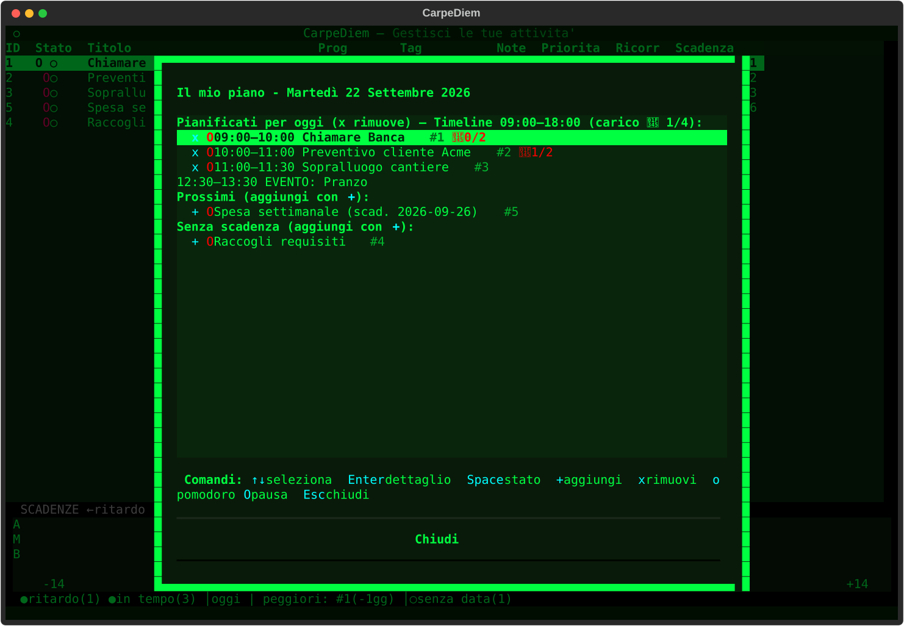
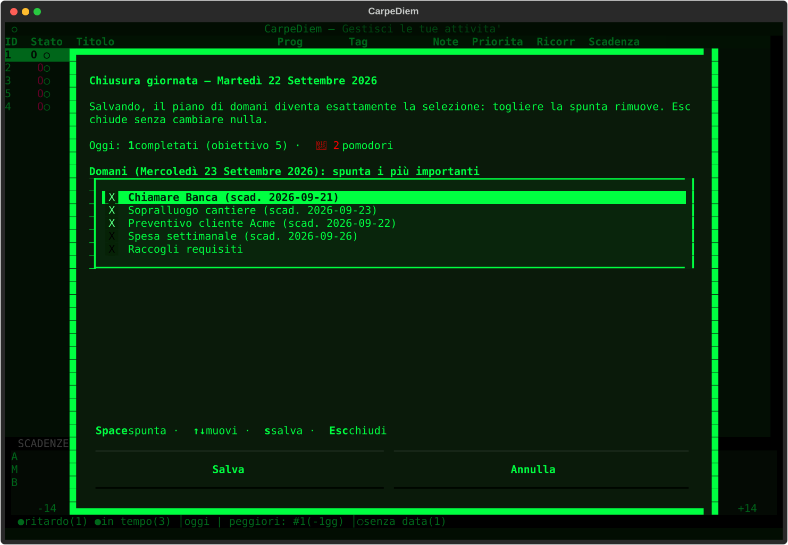
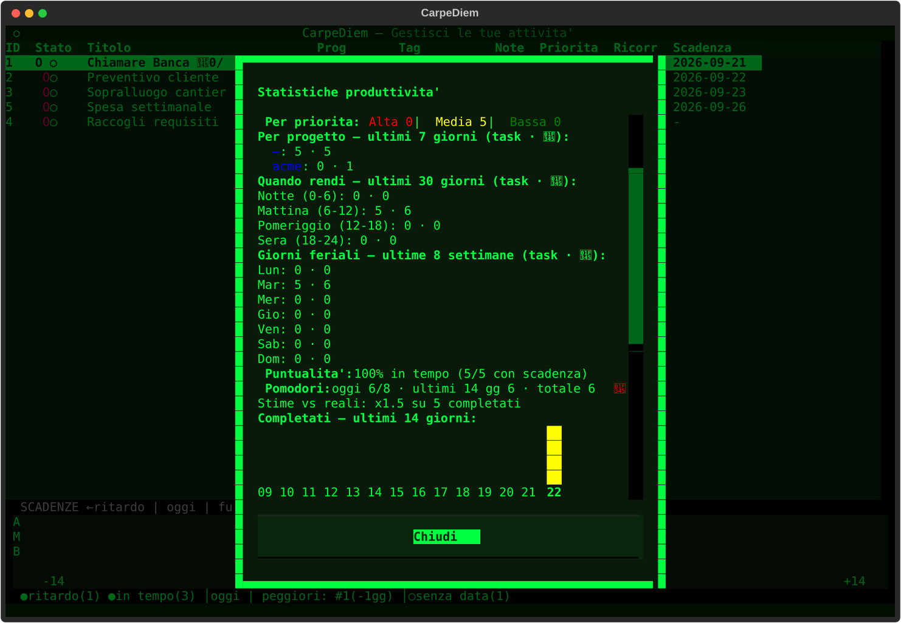
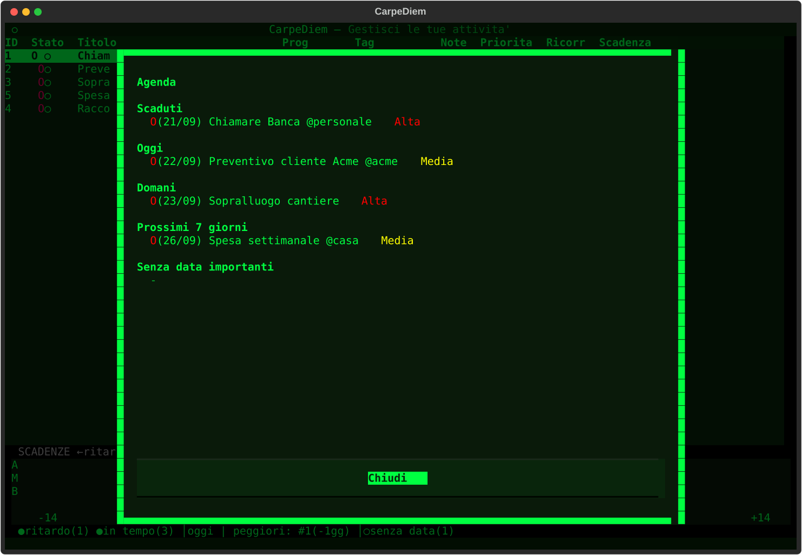

# CarpeDiem

[](https://github.com/fabx-dev/carpediem/actions) [](https://pypi.org/project/carpediem/)

CarpeDiem (carpe diem — cogli il giorno) trasforma appunti veloci in un piano giornaliero realistico: inserimento in linguaggio naturale, proposta smart al mattino con orari veri, pomodoro durante il giorno, chiusura serale. Offline, in italiano o inglese, senza account, senza rete nel percorso di pianificazione.

```text
Segna tutto in secondi (n, linguaggio naturale) → al mattino Buongiorno con proposta da confermare (P)
→ lavora dal Piano giorno con pomodoro (p, o) → la sera Chiusura giornata (R).
```

Dentro l'app, apri il menu (`m`) → `Giornata` → `Workflow consigliato` per la checklist quotidiana in 5 passi.

[Read in English](README.md)


*Home: tabella task con radar delle scadenze (priorità × orizzonte, `b` a ciclo grafico → testo → nascosto, click sul punto per aprire il task).*


*Buongiorno (`P`): finestra di disponibilità esplicita (`HH:MM–HH:MM`), eventi fissi (`HH:MM-HH:MM Titolo`) e proposta con slot `HH:MM–HH:MM`, più il contesto di oggi sopra. La conferma aggiunge soltanto — `Esc` non scrive.*


*Piano giorno (`p`): i confermati ri-schedulati nella finestra persistita, con prefissi `HH:MM–HH:MM` inline, righe `EVENTO:` in sola lettura e marker `▶` sul task del pomodoro. Tutto operativo (`Enter`/`Space`/`o`/`O`/`x`).*


*Chiusura giornata (`R`): riepilogo di oggi (fatti vs obiettivo, pomodori) e scelta che diventa esattamente il piano di domani.*


*Statistiche (`k`): obiettivi e serie, dettaglio per progetto, orari di punta, puntualità, heatmap — più il fattore stime-vs-reali da cui il planner impara.*


*Agenda (`Giornata` → `Agenda`): il radar cronologico — scaduti, oggi, domani, prossimi 7 giorni, importanti senza data.*

## Installazione in 2 minuti

1. Serve Python 3.12+: verifica con `python3 --version`.
2. Consigliato: installazione isolata con pipx (mette `carpediem` sul PATH):
```bash
pipx install carpediem
```
Dal repo git:
```bash
pipx install git+https://github.com/fabx-dev/carpediem.git
```
3. Alternativa per sviluppatori (virtualenv):
```bash
python3 -m venv .venv
.venv/bin/pip install .
```
4. Avvia la TUI:
```bash
carpediem
```
Al primo avvio: carica i dati demo per esplorare, oppure inizia da zero.

Verifica che funzioni:
```bash
carpediem --help
carpediem list
```

Problemi comuni: `pipx: command not found` (installa prima pipx), Python vecchio (<3.12), dati separati con `TASKO_HOME=/tmp/carpediem-demo carpediem`. Docker (`docker compose up`) solo per sviluppo, non come installazione principale.

Serve Python 3.12+. Costruito con Textual; dati in JSON locali (vedi Dati sotto).

## Il loop quotidiano

1. **Cattura** — `n` apre il form; `ctrl+l` compila i campi dal titolo con `#tag *progetto !priorità ~stima //nota` (date in italiano o inglese, es. `domani`, `friday`). Stesso parser nella CLI: `carpediem add "Chiamare banca domani #telefonate *personale !alta"`. La scadenza ha anche il picker 📅; `Esc` non scrive mai.
2. **Mattina (`P`, Buongiorno)** — contesto (in piano, scadenze, ritardi, carico in 🍅 su capacità, ieri, serie) più proposta smart con motivi inline (scadenza, priorità, stime calibrate…). Imposti una finestra di disponibilità esplicita (`HH:MM–HH:MM`, overnight rifiutato) ed eventuali eventi fissi (uno per riga `HH:MM-HH:MM Titolo`, mai task persistiti); la proposta mostra slot `HH:MM–HH:MM` attorno a essi. La conferma è **solo additiva**: i già-pianificati restano, `Esc` non scrive, confermare con finestra vuota/invalida cancella quella persistita (niente riusi stantii).
3. **Esecuzione (`p`, Piano giorno)** — la scheda operativa: esattamente i confermati (`planned_for == oggi`), ri-schedulati nella finestra persistita in ordine di merito del Planner. Le righe schedulate hanno prefisso `HH:MM–HH:MM` inline e restano operative (`Enter` dettaglio, `Space` stato, `o`/`O` pomodoro, `x` rimuovi); gli eventi fissi compaiono come righe `EVENTO:` in sola lettura; i senza-slot attendono in coda senza prefisso. Il marker `▶` segue il pomodoro in corso; il resoconto sera aggiunge la sezione `Pianificato vs eseguito` (stima, slot, sessioni, reali, stato).
4. **Chiusura (`R`, Chiusura + resoconto sera)** — `R` mostra l'oggi (completati vs obiettivo, pomodori) e la scelta che diventa *esattamente* il piano di domani; il resoconto sera (`Giornata` → `Resoconto sera`) riepiloga fatti/rimasti, stampa e salta a `R` in un click. Senza finestra confermata il piano mostra righe semplici, mai un default 09:00–18:00 inventato.

Note sul planner: deterministico (stessi input → stesso piano) e spiegabile (ogni riga ha il suo motivo). `day_hours` nelle Impostazioni è **capacità**, non orario di lavoro. Un task senza stima vale 1 pomodoro (30 min) ai soli fini di pianificazione — fallback, mai stima utente. Completare un task stimato chiede i pomodori reali (precompilati coi contati); il planner calibra col fattore mediano locale (min 5 campioni) mostrato nelle Statistiche. Niente rete, niente AI, niente calendario esterno nella v1.

## Viste

### Giornata: agenda, piani, calendario
- `Workflow consigliato` — checklist in 5 passi (cattura / mattina / giorno / sera / settimana), prima voce di `Giornata`.
- `Buongiorno` (`P`) — contesto + proposta + slot, vedi loop passo 2.
- `Agenda` — radar cronologico: scaduti, oggi, domani, prossimi 7 giorni, importanti senza data.
- `Piano giorno` (`p`) — piano manuale di oggi (`+` aggiunge dai Prossimi, `x` rimuove, `Space` sospende, `Enter` dettaglio, `o`/`O` pomodoro).
- `Settimana` (`w`) / `Calendario` (`c`) — striscia settimanale e mese navigabile (giorno → piano giorno).
- `Resoconto sera` / `Chiusura giornata` (`R`) — riepilogo + stampa + scelta di domani.

### Viste e analisi
- Radar scadenze (`b` a ciclo grafico → testo → nascosto, `B` board completa) — scatter priorità × orizzonte con linea oggi, caption dei peggiori e conteggio senza-data; click sul punto per il dettaglio (o picker sulle sovrapposizioni). A radar vuoto torna al testo da solo, senza sovrascrivere la tua preferenza.
- `Statistiche` (`k`) — obiettivi/serie, totali settimana, per priorità e per progetto, fasce orarie e giorni di punta, pomodori, completati 14 gg, puntualità, heatmap 🍅, fattore stime-vs-reali; export CSV.
- `Smart list` — dai un nome al filtro home attuale (stato/tag/progetto/ricerca) e riapplicalo in un click da menu o palette (`ctrl+p`); qualunque tocco manuale sgancia al manuale (max 10, nomi unici).
- `Salute progetti` (`y`) — OK / a rischio / critici per progetto (avanzamento, ritardi, momentum).
- `Template` (`T`) — creabili/modificabili/applicabili, anche da progetto.
- `Obiettivi` — target giornalieri/settimanali con serie.

### Dati: backup, trasferimento, archivio
- `Backup ora` / `Ripristina backup` — snapshot zip automatici in `~/Tasko_backups/` (14 tenuti), ripristino validato prima di toccare il disco con rollback.
- `Export: Markdown` (`ctrl+e`) / `CSV` / `CSV statistiche` / `iCal` — l'`.ics` copre i task attivi con scadenza; i file finiscono in `~/CarpeDiem_screenshots/`.
- `Import: CSV` — idempotente su `(source, external_id)` (re-import salta, id interni intatti; righe senza external id sempre nuove).
- `Archivio` — completati da parte con vista e ripristino.

### Sistema
- `Impostazioni` — tema, filtri, obiettivi, lingua, capacità `day_hours` (1–16).
- `Sicurezza` — cifratura Fernet opzionale (PBKDF2, chiave solo in RAM); i file blindati si leggono come vuoti, mai come corrotti.
- `Screenshot` (`ctrl+s`) — cattura SVG in `~/CarpeDiem_screenshots/`.
- `Pulisci filtri`, `Tema` (`v`), elenco `Tasti`, `Ricarica` (`r`), `Esci` (`q`).

## Tasti

| Tasto | Azione |
|---|---|
| `n` / `s` | Nuovo todo / sotto-task del selezionato |
| `ctrl+l` (nel form) | Compila i campi dal titolo (linguaggio naturale) |
| `Space` poi `1/2/3` | Attivo / Sospeso / Fatto (griglia con frecce + `Enter`) |
| `Enter` / `e` | Dettagli (con modifica) / Modifica |
| `d` / `u` | Elimina (conferma) / Annulla eliminazione |
| `o` / `O` / `X` | Avvia-apri pomodoro / pausa-riprendi / completa-salta |
| `P` / `p` | Buongiorno con proposta / Piano giorno |
| `R` / `r` | Chiusura giornata / Ricarica |
| `b` / `B` | Radar grafico → testo → nascosto / board completa |
| `c` / `w` / `k` / `y` | Calendario / settimana / statistiche / salute progetti |
| `f` / `t` / `g` / `/` | Filtri stato, tag, progetto, ricerca |
| `Esc` (con ricerca attiva) | Pulisce solo la ricerca (altri filtri intatti) |
| `T` / `v` / `m` / `ctrl+p` | Template / tema / menu / palette comandi |
| `ctrl+s` / `ctrl+e` | Screenshot SVG / export Markdown |
| `q` | Esci |

Il menu `m` raccoglie tutto (Giornata / Viste e analisi / Dati / Sistema). Nel footer si vede solo `m ☰ Menu`; la palette (`ctrl+p`, `Categoria › Voce`) contiene ogni comando con la sua scorciatoia.

## CLI

```bash
carpediem add "Chiamare banca domani #telefonate *personale !alta ~2"  # linguaggio naturale (default)
carpediem add "Comprare latte" --project casa --due 2026-09-30 --priority alta --tags spesa
carpediem list                          # tutti, per scadenza poi titolo
carpediem list --state active --project casa
carpediem list --porcelain               # id|stato|priorità|scadenza|titolo, per script
carpediem done 12
carpediem show 12
```

`add` senza flag analizza la frase (`#tag *progetto !prio ~stima //nota`, ricorrenze, date it/en); con flag il titolo è letterale. `done`/`show` usano gli id; errori su stderr con exit code.

## Dati

Tutto in JSON locali vicino alla home (offline-first):

| File | Contenuto |
|---|---|
| `~/.todo_app.json` | Task (+ copia `.bak.json` precedente; campi includono `actual_pomo/minutes`, `source/external_id`) |
| `~/.todo_templates.json` | Template |
| `~/.todo_pomodoro.json` | Sessione timer + ciclo |
| `~/.todo_config.json` | Tema, filtri, obiettivi, lingua, `day_hours`, `kanban_mode`, `smart_lists` (max 10), `day_window` (`{date, start, end, events[]}`) |
| `~/.todo_archive.json` | Completati archiviati |
| `~/Tasko_backups/` | Snapshot zip automatici (14 tenuti) |
| `~/CarpeDiem_screenshots/` | Screenshot SVG, export CSV/Markdown |

Scrittura a punto unico `commit()` con lock inter-processo e merge three-way per id (CLI e TUI non si sovrascrivono). Ripristino dal menu (`Backup: ripristina`). Cifratura opzionale da `Sistema` → `Sicurezza`. Lingua automatica dal sistema, forzabile con `TASKO_LANG=it|en` o dalle Impostazioni; dati isolabili con `TASKO_HOME=/tmp/demo`.

## Sviluppo

```bash
pip install -r requirements-dev.txt
python -m pytest tests/ -q
python -m ruff check src/ tests/
```

Vedi [CONTRIBUTING.md](CONTRIBUTING.md). Progetto hobbistico, italiano-first: issue in italiano o inglese benvenute.

## Licenza

MIT — vedi [LICENSE](LICENSE) e [CHANGELOG.md](CHANGELOG.md).
