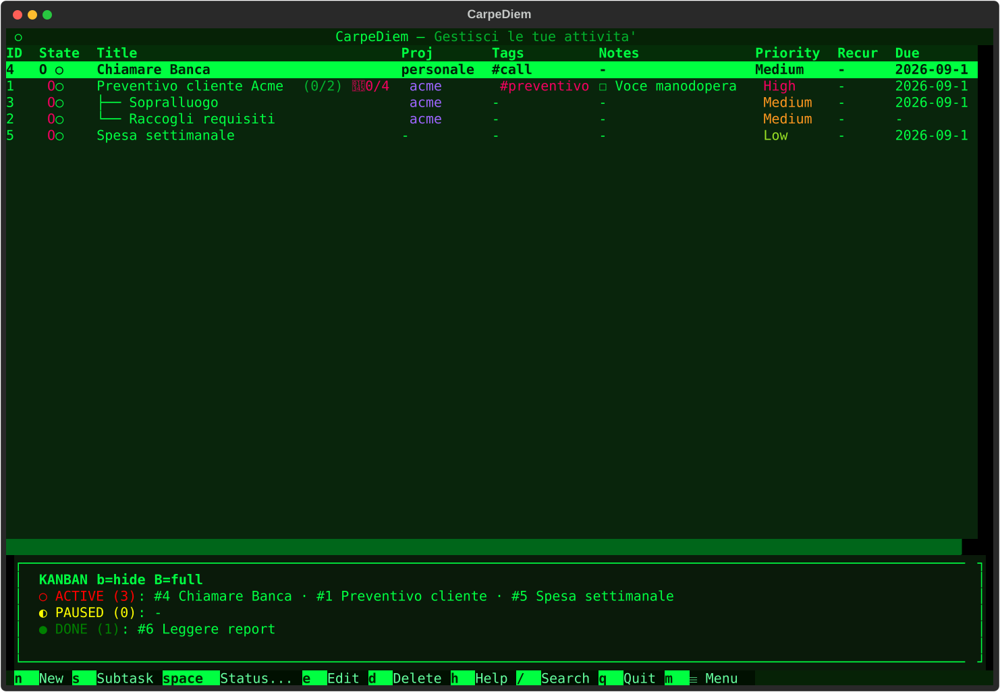
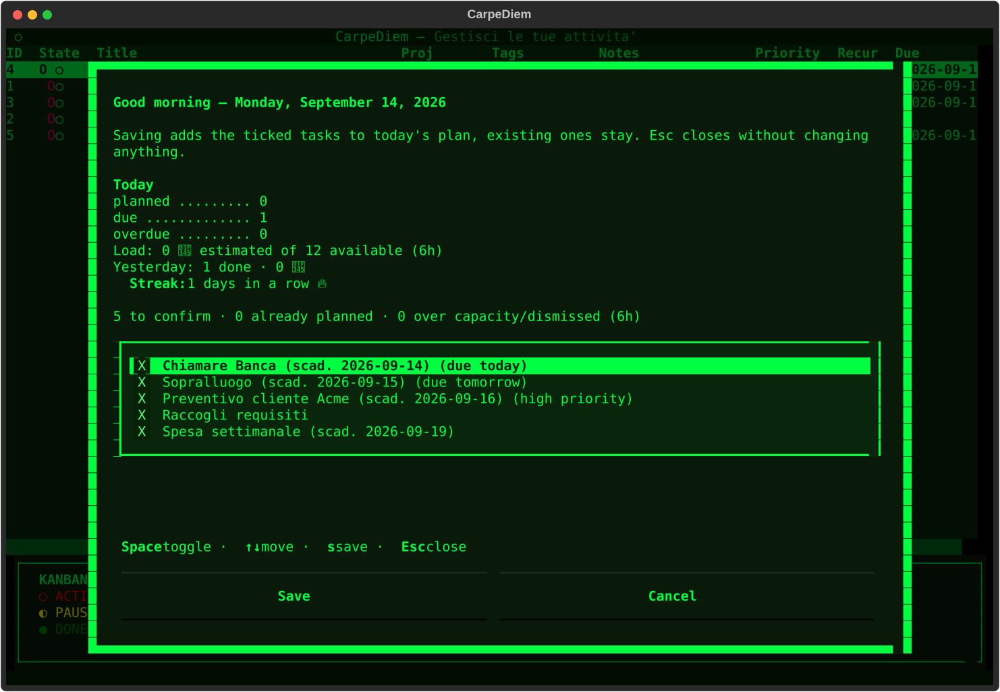
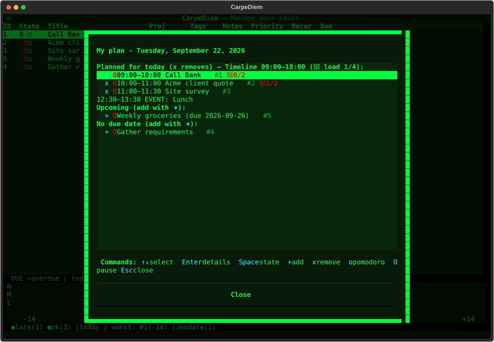
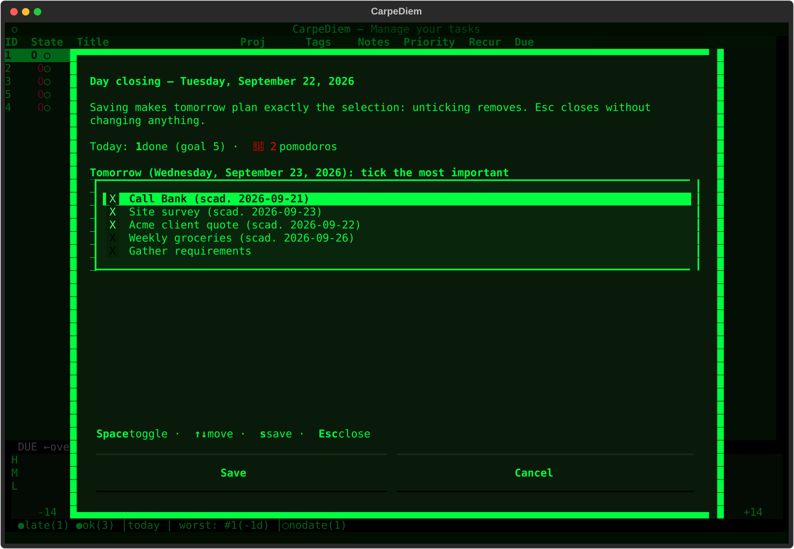
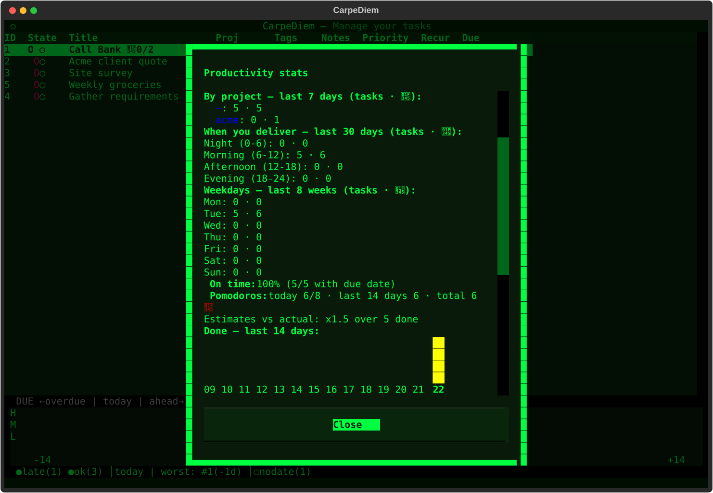
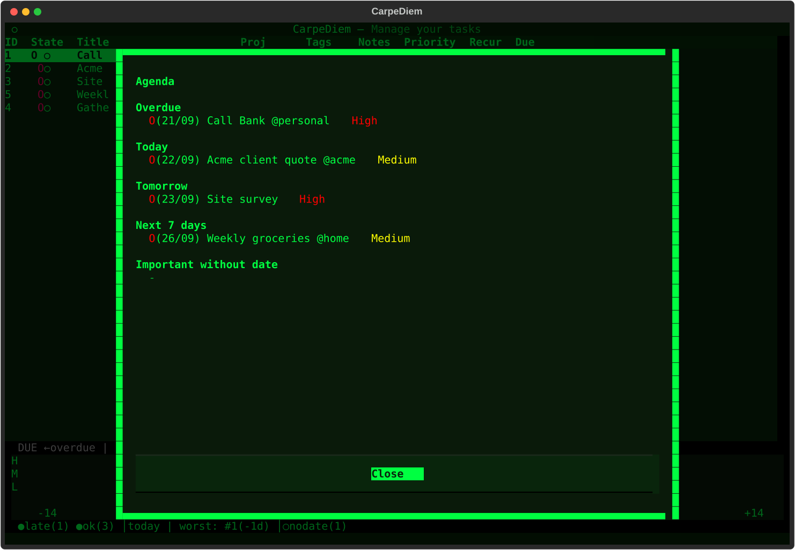

# CarpeDiem

[](https://github.com/fabx-dev/carpediem/actions) [](https://pypi.org/project/carpediem/)

CarpeDiem (carpe diem — seize the day) turns quick notes into a realistic day plan: natural-language capture, a smart morning proposal with real time slots, pomodoro focus during the day, evening closing. Offline-first, in English or Italian, no account, no network in the planning path.

```text
Capture in seconds (n, natural language) → morning proposal to confirm (P)
→ work from the Day plan timeline with pomodoro (p, o) → evening Closing (R).
```

In the app, open the menu (`m`) → `Day` → `Recommended workflow` for the 5-step daily checklist.

[Leggimi in italiano](README.it.md)


*Home: task table with the due-date radar (priority × horizon, `b` cycles chart → text → hidden, click a dot to open the task).*


*Buongiorno (`P`): explicit availability window (`HH:MM–HH:MM`), fixed events (`HH:MM-HH:MM Title`) and the proposal with `HH:MM–HH:MM` slots plus today context above. Confirming only adds — `Esc` writes nothing.*


*Day plan (`p`): the confirmed tasks re-scheduled in the persisted window, with inline `HH:MM–HH:MM` prefixes, read-only `EVENT:` rows and the `▶` marker on the pomodoro task. Fully operational (`Enter`/`Space`/`o`/`O`/`x`).*


*Day closing (`R`): today summary (done vs goal, pomodoros) and the picker that becomes exactly tomorrow's plan.*


*Stats (`k`): goals and streaks, per-project breakdown, peak hours, punctuality, heatmap — plus the estimates-vs-actual factor the planner learns from.*


*Agenda (`Day` → `Agenda`): the chronological radar — overdue, today, tomorrow, next 7 days, important undated.*

## Install in 2 minutes

1. You need Python 3.12+: check with `python3 --version`.
2. Recommended: isolated install with pipx (puts `carpediem` on your PATH):
```bash
pipx install carpediem
```
From the git repo:
```bash
pipx install git+https://github.com/fabx-dev/carpediem.git
```
3. Alternative for developers (virtualenv):
```bash
python3 -m venv .venv
.venv/bin/pip install .
```
4. Start the TUI:
```bash
carpediem
```
On first run: load the demo data to explore, or start empty.

Check it works:
```bash
carpediem --help
carpediem list
```

Common issues: `pipx: command not found` (install pipx first), old Python (<3.12), separate data dir with `TASKO_HOME=/tmp/carpediem-demo carpediem`. Docker (`docker compose up`) is dev-only, not the main install path.

Requires Python 3.12+. Built with Textual; data stays in local JSON (see Data below).

## The daily loop

1. **Capture** — `n` opens the form; `ctrl+l` fills the fields from the title using `#tag *project !priority ~estimate //note` (dates in Italian or English, e.g. `domani`, `friday`). Same parser in the CLI: `carpediem add "Call bank tomorrow #calls *personal !high"`. The due field also has a `📅` calendar picker; `Esc` never writes.
2. **Morning (`P`, Buongiorno)** — context (planned, due, overdue, load in 🍅 over capacity, yesterday, streak) plus the smart proposal with inline reasons (deadline, priority, calibrated estimates…). You set an explicit availability window (`HH:MM–HH:MM`, overnight rejected) and optional fixed events (one per line `HH:MM-HH:MM Title`, never persisted as tasks); the proposal shows `HH:MM–HH:MM` slots around them. Confirming is **additive only**: already-planned stay, `Esc` writes nothing, confirming with an empty/invalid window clears the persisted one (no stale reuse).
3. **Execution (`p`, Day plan)** — the operational sheet: exactly the confirmed tasks (`planned_for == today`), re-scheduled in the persisted window in Planner merit order. Scheduled rows carry an inline `HH:MM–HH:MM` prefix and stay fully operational (`Enter` detail, `Space` state, `o`/`O` pomodoro, `x` remove); fixed events appear as read-only `EVENT:` rows; tasks without a slot wait at the tail without a prefix. The `▶` marker follows the running pomodoro; the evening report adds a `Planned vs executed` section (estimate, slot, sessions, actuals, state).
4. **Closing (`R`, Day closing + evening report)** — `R` shows today (done vs goal, pomodoros) and the picker that becomes *exactly* tomorrow's plan; the evening report (`Day` → `Evening report`) recaps done/leftovers, can print, and jumps to `R` in one click. No window, no slots invented: without a confirmed window the plan shows plain rows, never a default 09:00–18:00.

Planner notes: deterministic (same input → same plan) and explainable (every row carries its reason). `day_hours` in Settings is **capacity**, not working hours. A task without an estimate counts as 1 pomodoro (30 min) for planning only — a fallback, never a user estimate. Finishing an estimated task asks for the actual pomodoros (pre-filled with the counted ones); the planner calibrates with the local median factor (min 5 samples) and shows it in Stats. No network, no AI, no external calendar in v1.

## Views

### Day: agenda, plans, calendar
- `Recommended workflow` — 5-step checklist (capture / morning / day / evening / week), first entry of `Day`.
- `Buongiorno` (`P`) — context + proposal + slots, see loop step 2.
- `Agenda` — chronological radar: overdue, today, tomorrow, next 7 days, important undated.
- `Day plan` (`p`) — manual plan of today (`+` add from Upcoming, `x` remove, `Space` pause, `Enter` detail, `o`/`O` pomodoro).
- `Week` (`w`) / `Calendar` (`c`) — week strip and month calendar (day → day plan).
- `Evening report` / `Day closing` (`R`) — recap + print + tomorrow picker.

### Views and insights
- Due-date radar (`b` cycles chart → text → hidden, `B` full board) — strip-scatter priority × horizon with today line, worst-offenders caption and undated count; click a dot for the detail (or a picker on overlap). Falls back to text automatically when empty, without overwriting your preference.
- `Stats` (`k`) — goals/streaks, week totals, per-priority and per-project, time-of-day and weekday peaks, pomodoros, 14-day completions, punctuality, 🍅 heatmap, estimates-vs-actual factor; CSV export.
- `Smart lists` — name the current home filter (state/tag/project/search) and reapply it in one click from menu or palette (`ctrl+p`); any manual filter touch detaches back to manual (max 10, unique names).
- `Project health` (`y`) — OK / at-risk / critical per project (progress, overdue, momentum).
- `Templates` (`T`) — create/edit/apply, including from a project.
- `Goals` — daily/weekly targets with streaks.

### Data: backup, transfer, archive
- `Backup now` / `Restore backup` — automatic zip snapshots in `~/Tasko_backups/` (14 kept), restore validates before touching disk with rollback.
- `Export: Markdown` (`ctrl+e`) / `CSV` / `stats CSV` / `iCal` — the `.ics` covers active tasks with due dates; files land in `~/CarpeDiem_screenshots/`.
- `Import: CSV` — idempotent on `(source, external_id)` (re-import skips, internal ids untouched; rows without external id are always new).
- `Archive` — done tasks aside with viewer and restore.

### System
- `Settings` — theme, filters, goals, language, `day_hours` capacity (1–16).
- `Security` — optional Fernet encryption (PBKDF2, key in RAM only); locked files read as empty, never as corrupt.
- `Screenshot` (`ctrl+s`) — SVG capture to `~/CarpeDiem_screenshots/`.
- `Clear filters`, `Theme` (`v`), `Keys` list, `Refresh` (`r`), `Quit` (`q`).

## Keys

| Key | Action |
|---|---|
| `n` / `s` | New todo / subtask of selected |
| `ctrl+l` (in form) | Fill fields from title (natural language) |
| `Space` then `1/2/3` | Active / Paused / Done (grid with arrows + `Enter`) |
| `Enter` / `e` | Details (with inline edit) / Edit |
| `d` / `u` | Delete (confirm) / Undo |
| `o` / `O` / `X` | Start-open pomodoro / pause-resume / complete-skip |
| `P` / `p` | Buongiorno proposal / Day plan |
| `R` / `r` | Day closing / Refresh |
| `b` / `B` | Radar chart → text → hidden / full board |
| `c` / `w` / `k` / `y` | Calendar / week / stats / project health |
| `f` / `t` / `g` / `/` | State, tag, project, search filters |
| `Esc` (search active) | Clear search only (other filters kept) |
| `T` / `v` / `m` / `ctrl+p` | Templates / theme / menu / command palette |
| `ctrl+s` / `ctrl+e` | Screenshot SVG / Markdown export |
| `q` | Quit |

Press `m` for the menu (Day / Views and insights / Data / System). The footer shows only `m ☰ Menu`; the palette (`ctrl+p`, `Category › Entry`) holds every command with its shortcut.

## CLI

```bash
carpediem add "Call bank tomorrow #calls *personal !high ~2"  # natural language (default)
carpediem add "Buy milk" --project home --due 2026-09-30 --priority alta --tags spesa
carpediem list                          # all, sorted by due then title
carpediem list --state active --project home
carpediem list --porcelain               # id|state|priority|due|title, script-friendly
carpediem done 12
carpediem show 12
```

`add` without flags parses the phrase (`#tag *project !prio ~estimate //note`, recurrence, dates it/en); with flags the title is taken literally. `done`/`show` use ids; errors go to stderr with exit codes.

## Data

Everything lives in local JSON next to your home (offline-first):

| File | Content |
|---|---|
| `~/.todo_app.json` | Tasks (+ `.bak.json` previous copy; fields include `actual_pomo/minutes`, `source/external_id`) |
| `~/.todo_templates.json` | Templates |
| `~/.todo_pomodoro.json` | Timer session + cycle |
| `~/.todo_config.json` | Theme, filters, goals, language, `day_hours`, `kanban_mode`, `smart_lists` (max 10), `day_window` (`{date, start, end, events[]}`) |
| `~/.todo_archive.json` | Archived done tasks |
| `~/Tasko_backups/` | Automatic zip snapshots (14 kept) |
| `~/CarpeDiem_screenshots/` | SVG screenshots, CSV/Markdown exports |

Single-writer `commit()` with inter-process lock and three-way per-id merge (CLI and TUI never overwrite each other). Restore a backup any time from the menu (`Backup: restore`). Optional encryption from `System` → `Security`. Language follows the system (Italian or English), override with `TASKO_LANG=it|en` or in Settings; isolate data with `TASKO_HOME=/tmp/demo`.

## Dev

```bash
pip install -r requirements-dev.txt
python -m pytest tests/ -q
python -m ruff check src/ tests/
```

See [CONTRIBUTING.md](CONTRIBUTING.md). Hobby project, Italian-first: issues in Italian or English welcome.

## License

MIT — see [LICENSE](LICENSE) and [CHANGELOG.md](CHANGELOG.md).
